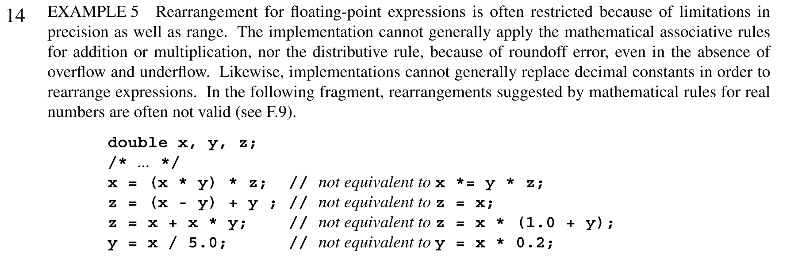

[](https://classroom.github.com/a/4X7h0Hun)
# SDSU Comp/CS 605 Spring 25 Assignment 3: Experiments in Vectorization in C

## Dot products

We begin by computing the dot product of two vectors

```c
double dot_ref(size_t n, const double *a, const double *b) {
  double sum = 0;
  for (size_t i=0; i<n; i++)
    sum += a[i] * b[i];
  return sum;
}
```

This reference (vanilla) implementation has (at least) two performance bottlenecks:

1. Limited by memory bandwidth for large array sizes `n`.
2. Data dependency from one loop iteration to another.

The first cannot be overcome without fusing with surrounding context or parts of your program (so the dot product is performed while memory is in cache for other reasons), but the second can be addressed by techniques such as the following, which relax data dependencies by reordering operations (in this case, summing the even- and odd-indexed values separately.).

```c
double dot_opt_even_odd(size_t n, const double *a, const double *b) {
  double sum0 = 0, sum1 = 0;
  for (size_t i=0; i<n; i+=2) {
    sum0 += a[i+0] * b[i+0];
    sum1 += a[i+1] * b[i+1];
  }
  return sum0 + sum1;
}
```

### Part 1: Optimizing dot product (30%)

Investigate how much performance impact the even-odd index technique above has. Explain your thinking and conclusions (perhaps supported by data/graphs) by writing in the Jupyter notebook [`Report.ipynb`](Report.ipynb) Part 1 section commentary. In addition to your commentary, answer the following questions:

1. Is this code correct for all values of `n`?
2. Can this code change the numerically computed result?
3. Can you extend this technique to increase performance further (longer vector registers and/or more instruction-level parallelism)?
4. Can you make the unrolling factor `2` a compile-time constant, perhaps by using an inner loop?
5. Could that unrolling factor be a run-time parameter?

### Can't the compiler do this?

The C standard does not allow floating point arithmetic to be reordered because it may change the computed values.

From C11 §5.1.2.3:

However, you may ask the compiler to attempt such optimizations anyway with the following compiler optimization flag (whose [documentation](https://gcc.gnu.org/onlinedocs/gcc/Optimize-Options.html) is reported here):

```
 -ffast-math
     Sets the options -fno-math-errno, -funsafe-math-optimizations, -ffinite-math-only, -fno-rounding-math, -fno-signaling-nans, -fcx-limited-range and -fexcess-precision=fast.

      This option causes the preprocessor macro __FAST_MATH__ to be defined.

      This option is not turned on by any -O option besides -Ofast since it can result in incorrect output for programs that depend on an exact implementation of IEEE or ISO rules/specifications for math functions. It may, however, yield faster code for programs that do not require the guarantees of these specifications.
```
This may result in unacceptable answers in other parts of your code.

## Part 2: Optimizing block inner product (%70)

Suppose we have many pairwise dot products to compute (like we do in a matrix-matrix multiply operation, $A B$). We can expose the rows of the matrix $A$ as

```math
A = \begin{bmatrix} {a}_{0}^{T}\\
{a}_{1}^{T}\\
\vdots\\
\end{bmatrix}
```

and the columns of the matrix $B$ as

$$
 B = [b_0 | b_1 | \dots ]
$$


We could perform the pairwise dot products by looping over each combination of vectors `[a0, a1, ...]` and vectors `[b0, b1, ...]`, computing `dot(a0, b0)`, `dot(a0, b1)`, `dot(a1, b0)`, ...

A C code snippet for this looks like

```c
void bdot_ref(size_t n, const double *a, const double *b, double *c) {
  for (size_t j=0; j<J; j++) {
    for (size_t k=0; k<K; k++) {
      c[j*K+k] = dot_ref(n, &a[j*n], &b[k*n]);
    }
  }
}
```
You can think of this as performing the matrix product

$$
C = A^T B
$$

where $A$ and $B$ are tall matrices of size $n \times J$ and $n \times K$ respectively.


### 2.1 (40%)
Write your own optimized code in the function `bdot_opt` (which now only contains a placeholder) for pairwise dot product sets of size `J=8` and `K=4` (so you'll be computing 32 inner products in total). Use the testing code provided in [`dot.c`](dot.c) to test your code and print the report.

You can create multiple variants, with different levels or strategies for optimization, and call them all from `main`.

Your optimization is allowed to change the layout in memory of the matrices `A` and `B` (see the `aistride`, `ajstride`, `bistride`, and `bkstride` parameters in the code).

### 2.2 (30%)
Explain your experiments and conclusions in Part 2 section of `Report.ipynb` commentary.

The following may be helpful:

* What does it mean to reorder loops?  Will it help or hurt performance?
* Does it help to change the layout in memory (see the `aistride`, `ajstride`, `bistride`, and `bkstride` parameters in the code)?
* Try using the [`#pragma omp simd` directive](https://sdsu-comp605.github.io/spring25/lectures/module3-2_intro_to_openmp.html) seen in class and the compiler option `-fopenmp-simd`.


### Submission expectations and requirements

In `Report.ipynb`, document any additional information that may be needed to run your code and reproduce your results and explain what obstacles you anticipate that may prevent reproduction.

If using a Python (ipykernel) kernel in your Jupyter notebook cell (and you can confirm that by looking at the top-right corner)


you can use shell commands by prepending them with a bang (`!`). For instance, to compile the `dot.c` program with the GNU (`gcc`) compiler with some optimization flags you would do

```
! gcc -O3 -march=native -fopenmp dot.c -o dot
```

Note that any library needed to compile the `dot.c` program, namely `rdtsc.h`, is included in this assignment repository. To execute your program from a cell, you can use the following:

```
! OMP_NUM_THREADS=4 ./dot -r 10 -n 10000
```

This tells the `gcc` compiler (which has OpenMP capabilities) to use 4 threads and run the `dot` exectutable for `10` repetitions, and array size `n` 10000.

Test your optimized blocked inner product code by running the same command but with the additional `-b` option:

```
! OMP_NUM_THREADS=4 ./dot -r 10 -n 10000 -b
```

You can add any cells to the Jupyter notebook to produce graphs/plots that corroborate your performance analysis (either in Python or Julia). You can have cells in Jupyter notebooks executed with different kernels -- just click on the Kernel menu and then Change Kernel.
